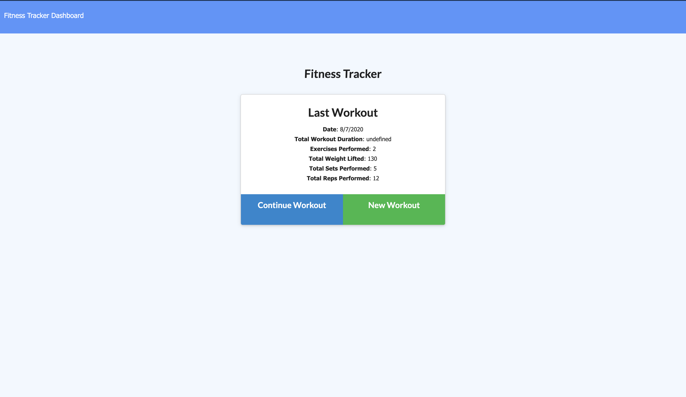

# Workout-Tracker
Workout tracker application that connects with a  Mongo database with a Mongoose schema and handle routes with Express.

  [](https://GitHub.com/Naereen/ama)

## Deployed link
-[https://workout-tracker-sergio.herokuapp.com/](https://workout-tracker-sergio.herokuapp.com/)


## Table of Contents
- [Installation](#Installation)
- [Usage](#Usage)
- [Technology](#Technology)
- [Tools](#Tools)
- [Contributing](#Contributing)
- [Questions](#Questions)

## Installation
```
git clone git@github.com:Cherjios/Workout-Tracker.git
cd Workout-Tracker.git
```
### Instaling npm packages 
```
npm init
npm install 
```

## Usage



## Technology
* [Javascript](https://developer.mozilla.org/en-US/docs/Web/)
* [MONGODB](https://www.mongodb.com/)
* [HTML](https://developer.mozilla.org/en-US/docs/Web/HTML)
* [CSS](https://developer.mozilla.org/en-US/docs/Web/CSS)

## Tools
* [Node.js](https://nodejs.org/en/)
* [npm](https://www.npmjs.com/)

## Contributing
* **SERGIO LOPEZ** 

- [Link to Portfolio Site](https://cherjios.github.io/Responsive-Portfolio/)
- [Link to Github](https://github.com/cherjios)
- [Link to LinkedIn](https://www.linkedin.com/in/sergio-lopez-81790579)

## Questions
 sc.lopezm@gmail.com

